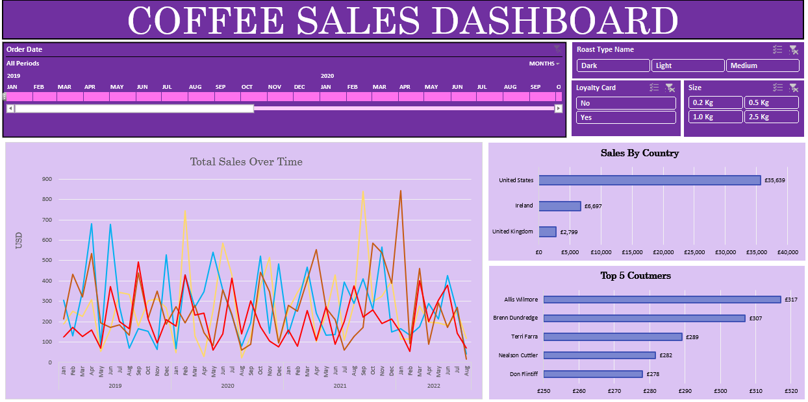

📊 Coffee Orders Data Analysis
📅 Project Date: 13-02-2025
👨‍💻 Author: Muhammad Yousaf

📌 Project Overview
This project analyzes coffee sales data to identify key trends, customer preferences, and sales performance. The dataset includes order details such as date, product type, quantity, and revenue.

📊 Key Insights
✔️ Top-selling coffee types and seasonal trends ☕
✔️ Customer order frequency and preferences
✔️ Revenue trends across different time periods 📈
✔️ Performance of different coffee products

🛠️ Steps in the Analysis
Data Cleaning: Removed missing values, standardized formats.
Exploratory Data Analysis: Identified sales patterns and customer trends.
Visualization: Created dashboards for better insights.
Insights & Recommendations: Suggested actions to improve sales.
📸 Dashboard Preview
## 📊 Coffee Sales Dashboard

🚀 Tools Used
Microsoft Excel (Pivot Tables, Charts, Dashboards)
Power Query (For data transformation, if used)
📌 Next Steps & Improvements
🔹 More advanced visualizations using Power BI/Tableau
🔹 Predictive analytics for future coffee demand
🔹 Deeper insights into customer segmentation