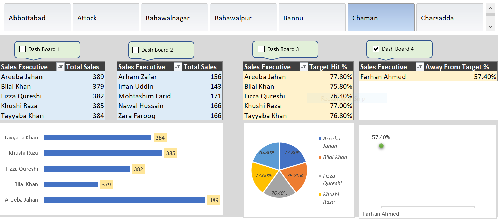

# 📊 Sales Performance Dashboard

## 📅 Project Date: 01-01-2025  
## 👨‍💻 Author: Muhammad Yousaf  

---

## 📌 Project Overview  
This Sales Performance Dashboard provides insights into the total sales achieved by sales executives across different regions. It helps businesses analyze key sales metrics, monitor performance against targets, and make data-driven decisions to optimize sales strategies.

## 🎯 Why This Dashboard?  
✔ Tracks individual sales performance across regions  
✔ Helps in identifying high-performing and underperforming sales executives  
✔ Provides insights into target achievement percentages  
✔ Aids decision-making through clear visual representation  

## 📊 Key Insights  
✔ **Total Sales Breakdown** – Displays sales performance by individual executives.  
✔ **Target Achievement %** – Highlights how close each executive is to their sales targets.  
✔ **Sales Trends** – Compares sales figures across different regions.  
✔ **Underperformance Analysis** – Identifies executives who need support to meet targets.  

## 🛠️ Tools & Technologies Used  
✔ **Microsoft Excel** – Pivot Tables, Charts, and Dashboards for data visualization.  
✔ **Power Query** – Used for data transformation and cleaning (if applicable).  

## 📸 Dashboard Preview  
  

🔗 **Access the Full Dashboard Here:** [Click to View](Sales_Performance.PNG)  

## 🚀 Business Impact  
✔ Helps sales managers track performance at a glance.  
✔ Identifies areas needing improvement for better business growth.  
✔ Enhances strategic decision-making with real-time insights.  

---

For any questions or suggestions, feel free to reach out! 🚀
